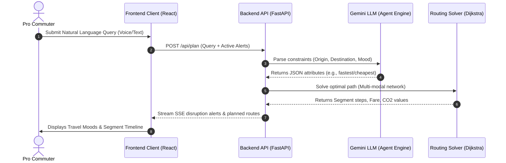

# YatrAI — Intelligent Unified Mobility Planner

[](https://vite.dev)
[](https://fastapi.tiangolo.com)
[](https://python.org)
[](https://leafletjs.com)

YatrAI is a state-of-the-art, premium multi-modal transit planner and digital boarding pass application designed to unify public transport across Chennai, Tiruchirappalli (Trichy), and their inter-city corridors. Powered by a custom Dijkstra routing engine and Gemini LLM natural language parsing, YatrAI delivers an executive-grade dashboard to streamline route navigation, live GPS telemetry tracking, automated fare escrow containment, and travel journaling.

---

## 🗺️ System Architecture

The diagram below illustrates the flow of telemetry and query calculations between the frontend canvas client and the backend routing engine services:



---

## ✨ Features

### 1. 🎙️ AI Voice Assistant & Tabbed Search
- **AI Voice Assistant Mode**: A unified natural language prompt bar with integrated audio wave visualizers (`graphic_eq`) and inline mic controls. Spoken queries (e.g., *"take me from SRM Dorm to Chennai Central"*) are transcribed and parsed.
- **Manual Mode**: Structured input fields featuring custom focus indicators (`.focus-glow`) and smart map markers (green dot origin, red pin destination) with Google-like location autocompletion.
- **On-Demand GPS Locator**: A green live telemetry status pill (*"Nearby: [Location]"*) that lets users populate their starting point instantly.

### 2. 💳 Premium Yatra Card & Escrow Wallet
- **Obsidian Membership Card**: A virtual credit-card styled widget with metallic gold chip render, gloss hover sweep reflection overlays, and masked billing numbers (`•••• 8829`).
- **Interactive UPI Gateway**: A secure, simulated UPI top-up portal. Successful transactions trigger vibrant particle bursts using `canvas-confetti`.
- **Dynamic Fare Escrow**: The backend automatically locks fare funds in an escrow hold at journey commencement, releasing payments segment-by-segment as the user scans tickets.

### 3. 🎫 Perforated Digital Boarding Pass
- **Unified Ticket Layout**: Rendered as an authentic boarding pass featuring ticket punch side cut-outs (`.ticket-cutout`) and a dynamic neon scanner indicator.
- **Bilingual Subtitles Bubble**: Displays live synthesized speech guidance translated into Tamil inside speech bubbles with replay buttons.
- **QR Ticket Scanner**: Integrates `html5-qrcode` to sim-scan fares safely at transit turnstiles, releasing escrow segments on verification.

### 4. 🛰️ Real-Time GPS Tracking Map
- **Leaflet Vector Tile Layers**: Integrated map tracking switching dynamically between CartoDB Dark Matter (Dark Mode) and CartoDB Voyager (Light Mode).
- **Blue GPS Accuracy Rings**: Draws radius bands indicating margin of resolution around active coords.

### 5. 📝 Travel Journal Column Grid
- **Obsidian 2-Column Dashboard**: Desktop layout separating active journal history from profile analytics.
- **Green Footprint Analytics**: Interactive dials indicating carbon saved, rewards tiers, and printable transit PDF invoice downloaders.

---

## 📂 Project Structure

```directory
yatr-ai/
├── backend/                   # Python FastAPI Server
│   ├── agents/                # LLM parsing agent services (Gemini Integration)
│   ├── data/                  # Transit database configurations, stop coordinates, places
│   ├── routing/               # Multi-modal Dijkstra engine
│   ├── services/              # Core modules (Wallet management, travel logging)
│   ├── main.py                # Main FastAPI router & app mount
│   ├── requirements.txt       # Python environment dependencies
│   └── test_*.py              # Suite of 10+ validation and API tests
│
├── frontend/                  # React / Vite Client Application
│   ├── src/
│   │   ├── components/        # Component canvas layouts (PlannerView, ActiveTripView, etc.)
│   │   ├── constants/         # Routing constants
│   │   ├── hooks/             # Custom React hooks (useGeoLocation, useVoiceInput)
│   │   ├── services/          # API services
│   │   └── App.jsx            # Main app controller & routing state
│   ├── index.html             # Tailwind configs, material fonts & global CSS style systems
│   ├── package.json           # Client packages configuration
│   └── vite.config.js         # Build tooling configurations
│
├── chennai_trichy_dataset.json# Expanded transit network database (734 routes)
└── test_routes.py             # Route schema and sequence integrity validator
```

---

## 🛠️ Getting Started (Local Setup)

### Prerequisites
- Python 3.11 or higher
- Node.js v18 or higher (v20+ recommended)
- A Gemini API Key (set in environmental configurations)

---

### 1. Backend Service Setup
Navigate to the root directory and set up a virtual python environment:

```powershell
# Create virtual environment
python -m venv backend/venv

# Activate virtual environment
# Windows (PowerShell):
.\backend\venv\Scripts\Activate.ps1
# macOS/Linux:
source backend/venv/bin/activate

# Install dependencies
pip install -r backend/requirements.txt

# Configure your environment variables (.env in backend directory)
# Example: GEMINI_API_KEY="your-gemini-api-key"
```

To run the database validator tests:
```powershell
python test_routes.py
```

To run the backend development server:
```powershell
python -m uvicorn main:app --port 8000
```
The API documentation will be available at [http://127.0.0.1:8000/docs](http://127.0.0.1:8000/docs).

---

### 2. Frontend Client Setup
Open a new terminal window, navigate to the `frontend` folder, and configure dependencies:

```powershell
# Navigate to frontend
cd frontend

# Install Node dependencies
npm install

# Run the local development server
npm run dev
```
Open your browser and navigate to [http://localhost:5173](http://localhost:5173).

---

## 🔌 Core API Reference

| Endpoint | Method | Description |
| :--- | :--- | :--- |
| `/api/plan` | `POST` | Calculates optimal transit routes based on NLP text query |
| `/api/wallet` | `GET` | Retrieves balance, escrow details, and statements history |
| `/api/wallet/deposit` | `POST` | Deposits mock funds into the YatraWallet |
| `/api/wallet/lock` | `POST` | Holds fare segment costs in escrow at trip start |
| `/api/wallet/release` | `POST` | Releases held segment fare to the transit provider |
| `/api/journal` | `GET` | Fetches logged journey history |
| `/api/journal/log` | `POST` | Logs a new travel entry semantically using LLM |

---

## 🚀 Production Deployments

Both services are live on Render:
- **Client Application URL**: [https://yatrai-frontend.onrender.com](https://yatrai-t1e0.onrender.com)
- **FastAPI Backend URL**: [https://yatrai-backend.onrender.com](https://yatrai.onrender.com)
